# Findings details

<!-- TODO: Severity after retest -->

## SQL injection in log in

- **Test CVSS severity**: critical
- **Test CVSS score:** 9.3
- **Test CVSS vector:** `CVSS:4.0/AV:N/AC:L/AT:N/PR:N/UI:N/VC:H/VI:H/VA:N/SC:N/SI:N/SA:N`
- **Description of the type of the vulnerability:** <https://owasp.org/www-community/attacks/SQL_Injection>
- **Description of the vulnerability :** an attacker can `bypass` the correct username/password check in the login by having the username as `asd' or 1=1 --` and the password as anything.
- **Impact:** severe impact; successful exploitation gives the attacker the ability to bypass login
- **Recommendations:** use prepared statements instead of interpolating user inputs in the login SQL queries

## SQL injection in REST API (accounts)

- **Test CVSS severity**: High
- **Test CVSS score:** 8.7
- **Test CVSS vector:** `CVSS:4.0/AV:N/AC:L/AT:N/PR:N/UI:N/VC:H/VI:N/VA:N/SC:N/SI:N/SA:N`
- **Description of the type of the vulnerability:** <https://owasp.org/www-community/attacks/SQL_Injection>
- **Description of the vulnerability :** an attacker can list all bank accounts on the system by passing the username as `asd' or 1=1 --` in the rest api authentication token and submitting a GET request to `/api/account`.
- **Impact:** severe impact; successful exploitation gives the attacker the ability to list all bank accounts on the system
- **Recommendations:** use prepared statements instead of interpolating user inputs in the listing bank accounts SQL queries and in the authentication queries

## SQL injection in transactions listing

- **Test CVSS severity**: High
- **Test CVSS score:** 7.1
- **Test CVSS vector:** `CVSS:4.0/AV:N/AC:L/AT:N/PR:L/UI:N/VC:H/VI:N/VA:N/SC:N/SI:N/SA:N`
- **Description of the type of the vulnerability:** <https://owasp.org/www-community/attacks/SQL_Injection>
- **Description of the vulnerability :** an attacker can list all transactions on the system by bypassing the front-end validation in the transactions filtering page and setting the start date as `2018-06-11` and the end date as `2018-06-11 23:59:59') OR 1=1 --`
- **Impact:** severe impact; successful exploitation gives the attacker the ability to list all transactions on the system
- **Recommendations:** use prepared statements instead of interpolating user inputs in the transactions listing SQL queries

## SQL injection in REST API (transactions)

- **Test CVSS severity**: High
- **Test CVSS score:** 7.1
- **Test CVSS vector:** `CVSS:4.0/AV:N/AC:L/AT:N/PR:L/UI:N/VC:H/VI:N/VA:N/SC:N/SI:N/SA:N`
- **Description of the type of the vulnerability:** <https://owasp.org/www-community/attacks/SQL_Injection>
- **Description of the vulnerability :** an attacker can list all transactions on the system by setting the start date as `2018-06-11` and the end date as `2018-06-11 23:59:59') OR 1=1 --` in the transaction listing REST API endpoint (`POST /api/account/800004/transactions`)
- **Impact:** severe impact; successful exploitation gives the attacker the ability to list all bank accounts on the system
- **Recommendations:** use prepared statements instead of interpolating user inputs in the listing bank accounts SQL queries and in the authentication queries

## Unauthorized file access (`Q3_earnings.rtf`)

- **Test CVSS severity**: High
- **Test CVSS score:** 8.7
- **Test CVSS vector:** `CVSS:4.0/AV:N/AC:L/AT:N/PR:N/UI:N/VC:H/VI:N/VA:N/SC:N/SI:N/SA:N`
- **Description of the type of the vulnerability:** An attacker can access a file they should not be allowed to access
- **Description of the vulnerability :** an attacker can download the bank's confidential earnings via visiting `/altoromutual/pr/Q3_earnings.rtf`.
- **Impact:** severe impact; successful exploitation gives the attacker the ability to download the bank's confidential earnings
- **Recommendations:** put the earnings file in a directory that is not served on the internet

## Unauthorized file access (`Draft.rtf`)

- **Test CVSS severity**: High
- **Test CVSS score:** 8.7
- **Test CVSS vector:** `CVSS:4.0/AV:N/AC:L/AT:N/PR:N/UI:N/VC:H/VI:N/VA:N/SC:N/SI:N/SA:N`
- **Description of the type of the vulnerability:** An attacker can access a file they should not be allowed to access
- **Description of the vulnerability :** an attacker can download the bank's confidential draft via visiting `/altoromutual/pr/Draft.rtf`.
- **Impact:** severe impact; successful exploitation gives the attacker the ability to download the bank's confidential draft
- **Recommendations:** put the draft file in a directory that is not served on the internet

## Path traversal attack

- **Test CVSS severity**: Critical
- **Test CVSS score:** 9.2
- **Test CVSS vector:** `CVSS:4.0/AV:N/AC:L/AT:N/PR:N/UI:N/VC:H/VI:N/VA:N/SC:H/SI:N/SA:N`
- **Description of the type of the vulnerability:** <https://owasp.org/www-community/attacks/Path_Traversal>
- **Description of the vulnerability :** an attacker can access configuration files that can contain secrets under `WebContent/WEB-INF` by going to `/index.jsp?content=../WEB-INF/name_of_the_file` (e.g, `/index.jsp?content=../WEB-INF/app.properties`)
- **Impact:** severe impact; successful exploitation gives the attacker the ability to access configuration files in the `WebContent/WEB-INF` directory which can contain passwords.
- **Recommendations:** make sure paths served in `index.jsp` do not escape the parent directory (follow OWASP's recommendations in the link above).

## Business logic flaw (excessive money transfer)

- **Test CVSS severity**: High
- **Test CVSS score:** 8.6
- **Test CVSS vector:** `CVSS:4.0/AV:N/AC:L/AT:N/PR:L/UI:N/VC:H/VI:H/VA:N/SC:N/SI:N/SA:N`
- **Description of the type of the vulnerability:** a defect in the business logic (lack of input validation)
- **Description of the vulnerability :** an attacker can transfer an amount (AM) of money from their account (A) to their other account (B) even if the amount (AM) exceeds the balance in account (A).
- **Impact:** severe impact; successful exploitation gives the attacker the ability to put an unlimited amount of money on one of their accounts and put a negative amount of money on another one of their accounts.
- **Recommendations:** make sure the user can not transfer an amount of money that is larger than his account's balance

# Finding scenarios

<!-- Fixing steps, re-test steps -->

## SQL injection in log in

### Test steps

- Open /altoromutual/login.jsp
- Login with the following credentials (password can be anything):

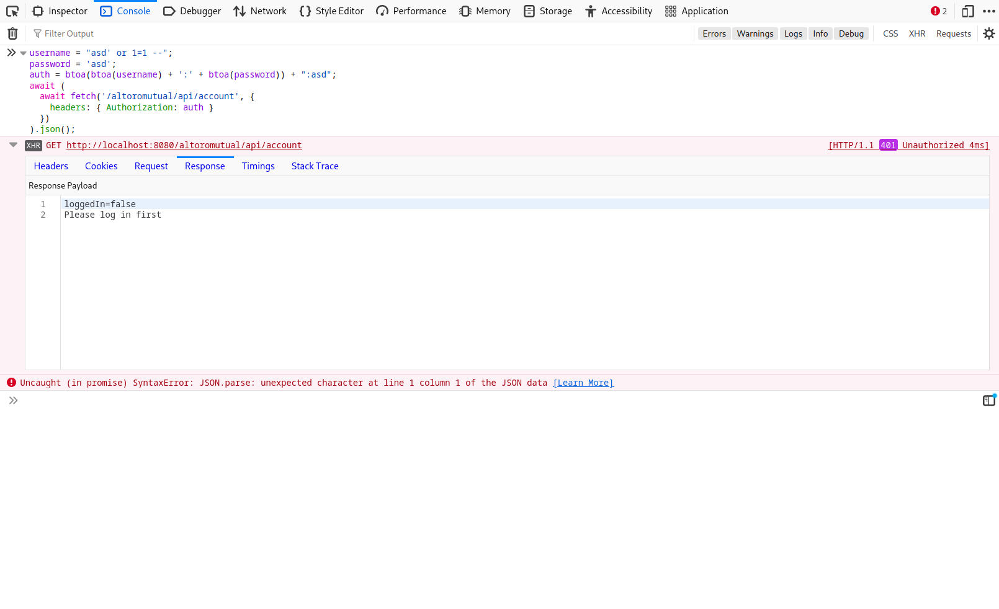

- Observe that you are logged in as the first user in the system:


### Cause

`DBUtil.isValidUser()` method interpolates the user input in the SQL query; hence making the attacker able to execute arbitrary queries. The resulting query becomes:

```sql
SELECT COUNT(*) FROM PEOPLE WHERE USER_ID = 'asd' or 1=1 -- AND PASSWORD='anything'")
```

## SQL injection in REST API (accounts)

### Test steps

- Open /altoromutual
- Run the following script in your browser's dev tools' console (F12 > console):

  ```javascript
  username = "asd' or 1=1 --";
  password = 'asd';
  res = await (
    await fetch('/altoromutual/api/login', {
      headers: { 'Content-Type': 'application/json' },
      method: 'POST',
      body: JSON.stringify({
        username,
        password
      })
    })
  ).json();

  auth = res.Authorization;

  await (
    await fetch('/altoromutual/api/account', {
      headers: { Authorization: auth }
    })
  ).json();
  ```

- Observe how all bank accounts are returned:


### Cause

- `DBUtil.getUserInfo()` method interpolates the user input in the SQL query; hence making the attacker able to execute arbitrary queries. The resulting query becomes:
  ```sql
  SELECT FIRST_NAME,LAST_NAME,ROLE FROM PEOPLE
  WHERE USER_ID = 'asd' or 1=1 --
  ```
- `DBUtil.getUserInfo()` returns the received username in the parameter rather than the one retrieved from the database (since it assumes they would be the same)
- `DBUtil.getAccounts()` is then called with the modified username and also interpolates the SQL query with the user input; hence the resulting query becomes:
  ```sql
  SELECT ACCOUNT_ID, ACCOUNT_NAME, BALANCE FROM ACCOUNTS
  WHERE USERID = 'asd' or 1=1 --
  ```
  leading to returning all of the users in the database

## SQL injection in transactions listing

### Test steps

- Go to `/altoromutual/bank/transaction.jsp`
- Run the following javascript in the browser console (F12 > console):

  ```javascript
  Form1.onsubmit = undefined;
  ```


- Set the start date as `2018-06-11` and the end date as `2018-06-11 23:59:59') OR 1=1 --`:


- Click submit and observe how all of the transactions on the system are shown:

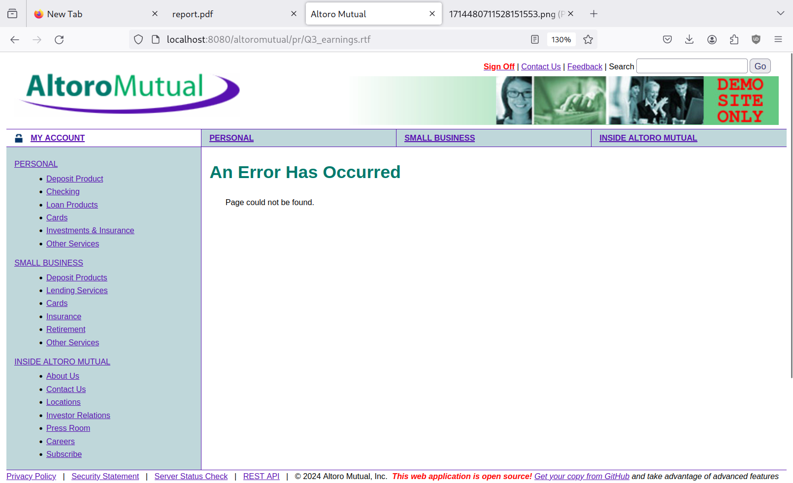

### Cause

`DBUtil.getTransactions()` method interpolates the user input in the SQL query; hence making the attacker able to execute arbitrary queries. The resulting query becomes:

```sql
SELECT * FROM TRANSACTIONS
WHERE (ACCOUNTID = 800004)
AND (DATE BETWEEN '2018-06-11 00:00:00' AND '2018-06-11 23:59:59')
OR 1=1 -- 23:59:59') ORDER BY DATE DESC
```

## Unauthorized file access (`Q3_earnings.rtf`)

### Test steps

- Click on "INSIDE ALTORO MUTUAL":


- Click on "2006 community annual report":


- Change the last part of the URL to `Q3_earning.rtf`:


- Download and view the file:

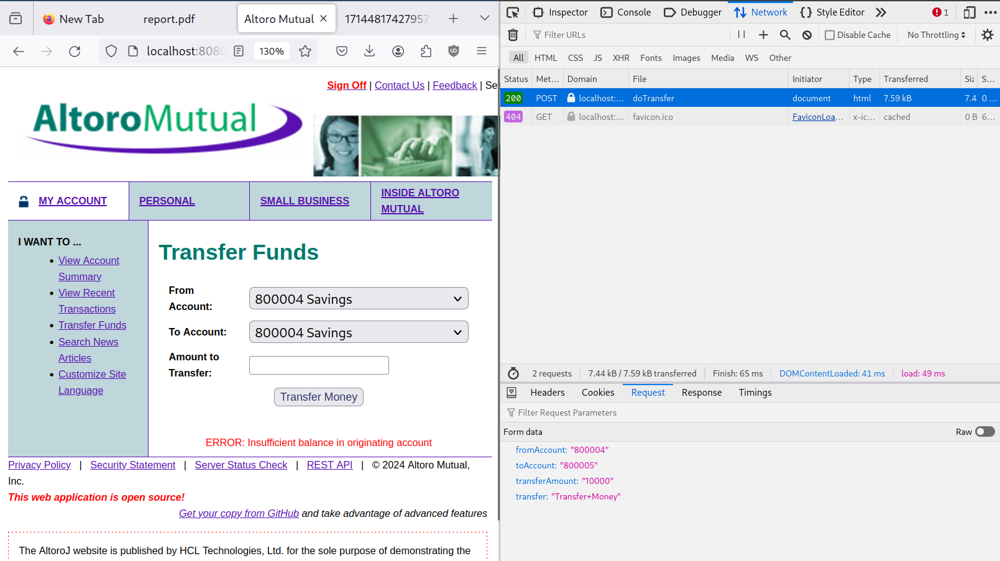

### Cause

Everything under the `WebContent` directory and not in the `WEB-INF` directory is served by Tomcat.

## Unauthorized file access (`Draft.rtf`)

### Test steps

- Click on "INSIDE ALTORO MUTUAL":


- Click on "2006 community annual report":


- Change the last part of the URL to `Draft.rtf`:


- Download and view the file:

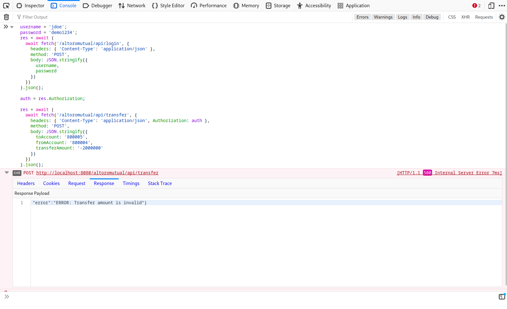

### Cause

Everything under the `WebContent` directory and not in the `WEB-INF` directory is served by Tomcat.

## Path traversal attack

### Test steps

- Visit `/altoromutual/index.jsp?content=../WEB-INF/app.properties` and observe an application configuration file get leaked

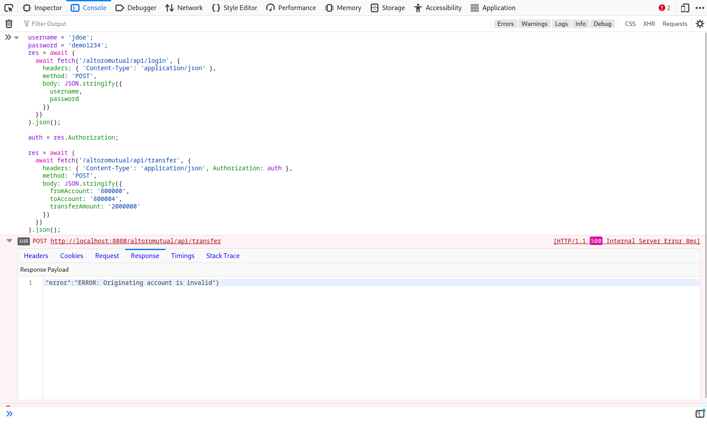

- Visit `/altoromutual/index.jsp?content=../WEB-INF/web.xml` and observe an application configuration file get leaked

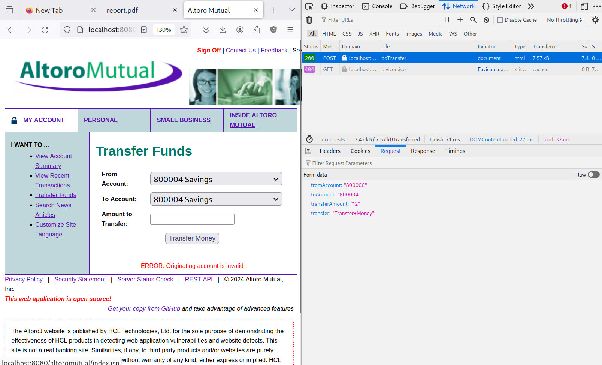

### Cause

In `index.jsp`, content is served from the `static/` directory using user provided subdirectories which can include dot-dot-slashes (`../`)

## Business logic flaw (excessive money transfer)

### Test steps

- Go to `View Account Summary`:

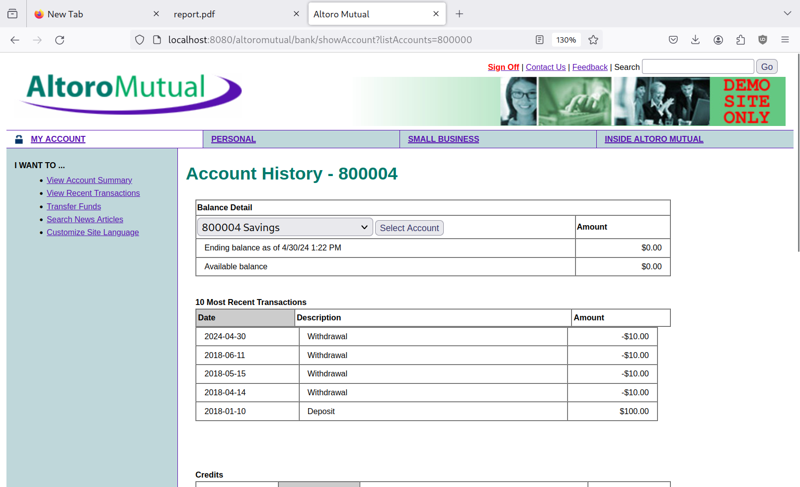

- Select an account (A) and make note of the available balance:

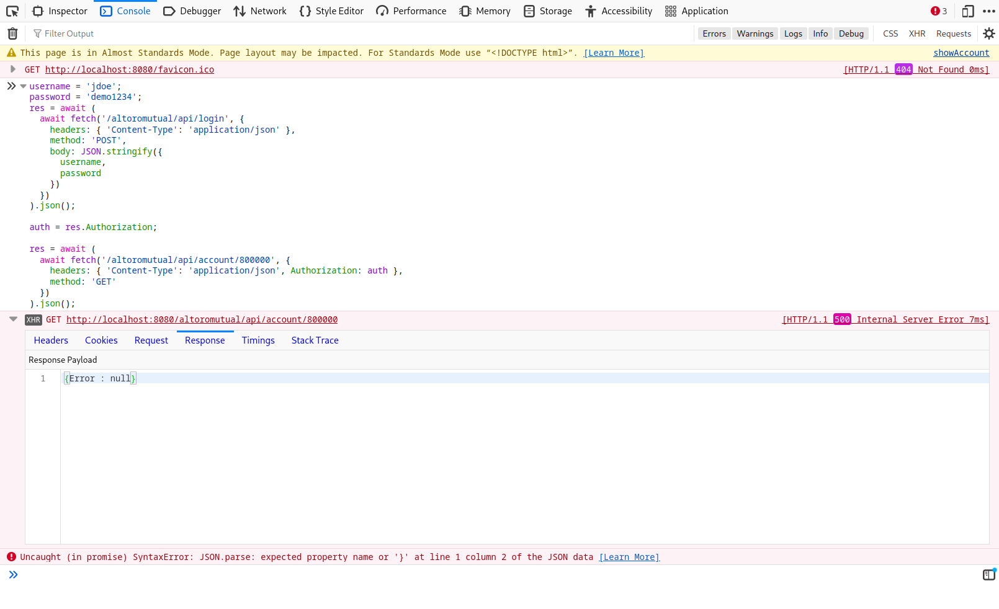

- Select an account (B) and make note of the available balance:

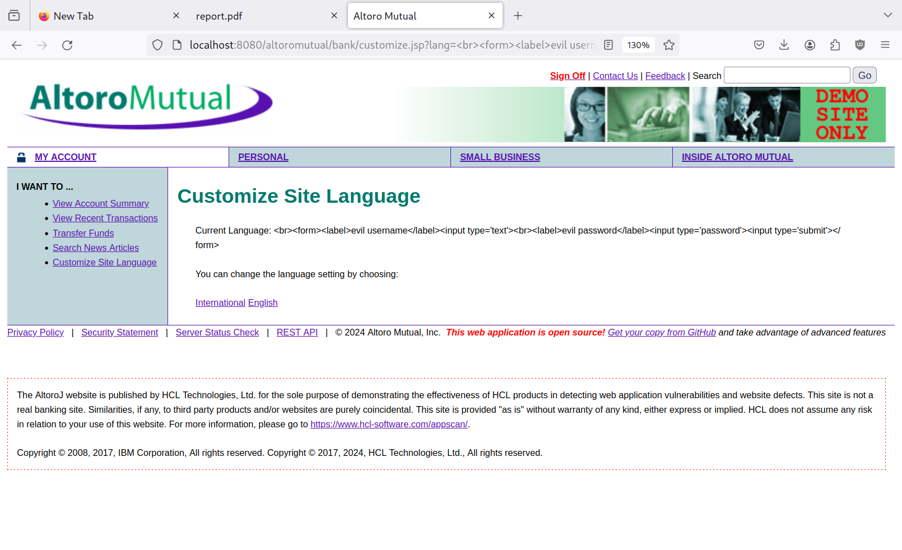

- Go to `Transfer Funds`, change the `To Account` and make note of it, enter an amount that is larger than the balance, click `Transfer Money`:

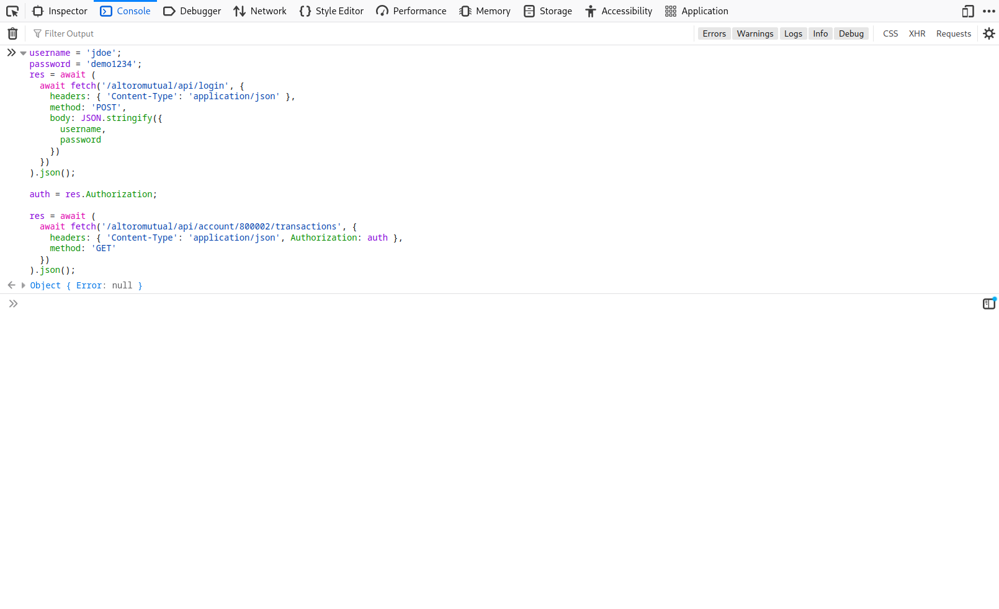

- Click `Transfer Money` and notice how the operation succeeds:

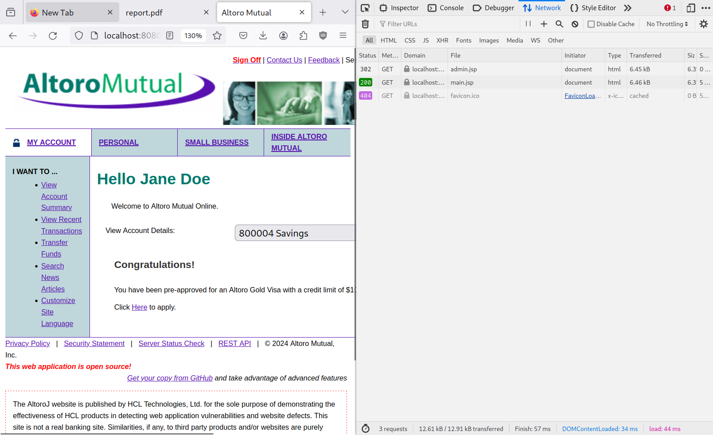

- View the available balance in account (A) and notice how it becomes negative:

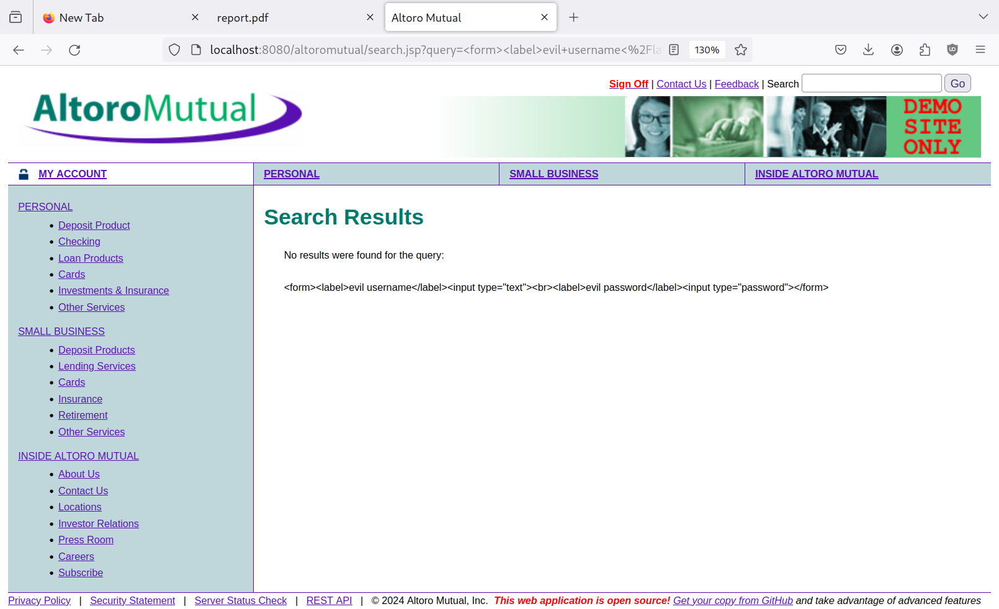

- View the available balance in account (B) and notice how it increases:

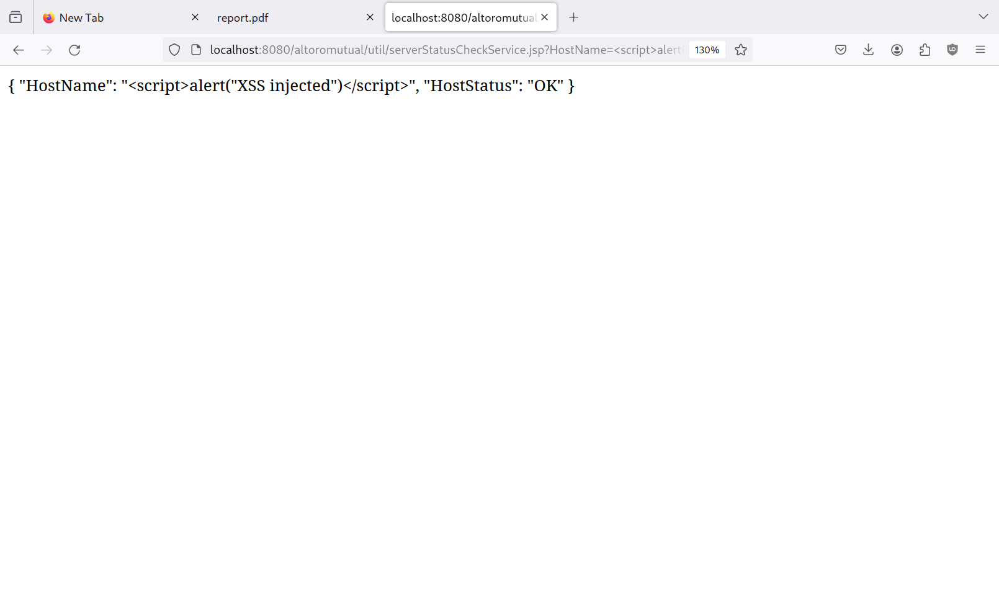
